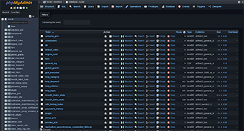

# pmahomme

A dark theme for [phpMyAdmin](https://www.phpmyadmin.net/), styled after GitHub's dark color palette.



## Overview

**pmahomme** is the default phpMyAdmin theme. This repository contains a customized dark variant built on GitHub's dark UI colors (`#0d1117` base background, `#6cb6ff` links, `#c9d1d9` text). It is built with SCSS and compiles to a single CSS bundle with RTL support.

## Compatibility

| Theme version | phpMyAdmin versions |
|---|---|
| 5.0 | 5.0, 5.1, 5.2 |

## Project Structure

```
pmahomme/
├── theme.json          # Theme metadata (name, version, author, compatibility)
├── screen.png          # Preview screenshot shown in the theme picker
├── css/
│   ├── theme.css       # Compiled CSS (production-ready)
│   ├── theme.css.map   # Source map for debugging
│   └── theme.rtl.css   # Right-to-left compiled CSS
├── scss/
│   ├── theme.scss      # Entry point — imports all partials
│   ├── _variables.scss # All design tokens (colors, spacing, typography)
│   ├── _common.scss    # Base layout and shared rules
│   ├── _navigation.scss# Left navigation panel
│   ├── _designer.scss  # Visual database designer
│   ├── _codemirror.scss# SQL editor (CodeMirror)
│   ├── _icons.scss     # Icon sprite overrides
│   ├── _tables.scss    # Data browse tables
│   ├── _forms.scss     # Input fields and form controls
│   ├── _buttons.scss   # Button variants
│   ├── _navbar.scss    # Top navigation bar
│   ├── _card.scss      # Card components
│   ├── _modal.scss     # Modal dialogs
│   ├── _alert.scss     # Alert / flash messages
│   ├── _pagination.scss# Pagination controls
│   ├── _breadcrumb.scss# Breadcrumb navigation
│   ├── _nav.scss       # Generic nav tabs / pills
│   ├── _list-group.scss# List group component
│   ├── _print.scss     # Print stylesheet
│   ├── _reboot.scss    # CSS reset overrides
│   ├── _jqplot.scss    # jqPlot chart styles
│   └── _enum-editor.scss# Enum/set field editor
├── img/                # 190+ PNG/SVG/ICO icon assets
└── jquery/
    ├── jquery-ui.css   # jQuery UI stylesheet
    └── images/         # jQuery UI icons
```

## Installation

1. Copy the `pmahomme` directory into your phpMyAdmin `themes/` folder:

   ```bash
   cp -r pmahomme /path/to/phpmyadmin/themes/
   ```

2. Log in to phpMyAdmin, go to **Settings → Themes**, and select **pmahomme**.

## Customization

All design tokens live in [scss/_variables.scss](scss/_variables.scss). Key variables:

| Variable | Default | Purpose |
|---|---|---|
| `$body-bg` | `#0d1117` | Page background |
| `$navi-background` | `#161b22` | Left nav background |
| `$main-color` | `#c9d1d9` | Body text color |
| `$link-color` | `#6cb6ff` | Link color |
| `$navi-width` | `240px` | Left navigation panel width |
| `$font-family-base` | `sans-serif` | Base font |
| `$font-size-base` | `0.82rem` | Base font size |

After editing variables, recompile the SCSS:

```bash
# Using sass CLI
sass scss/theme.scss css/theme.css --style=compressed --source-map

# RTL variant
sass scss/theme.scss css/theme.rtl.css --style=compressed --no-source-map
```

## Color Palette

The theme uses GitHub's dark color scale:

| Token | Hex | Usage |
|---|---|---|
| Canvas default | `#0d1117` | Page background |
| Canvas subtle | `#161b22` | Navigation, table rows |
| Canvas overlay | `#1c2128` | Table headers, secondary surfaces |
| Border default | `#30363d` | Borders and dividers |
| Fg default | `#c9d1d9` | Body text |
| Fg muted | `#8b949e` | Muted / secondary text |
| Accent emphasis | `#1f6feb` | Active states, primary buttons |
| Accent fg | `#6cb6ff` | Links |

## RTL Support

A precompiled RTL stylesheet is included at `css/theme.rtl.css` for right-to-left language support. phpMyAdmin loads this automatically when the interface language is set to an RTL locale.

## License

This theme follows the same license as phpMyAdmin — [GNU GPL v2 or later](https://www.gnu.org/licenses/gpl-2.0.html).
